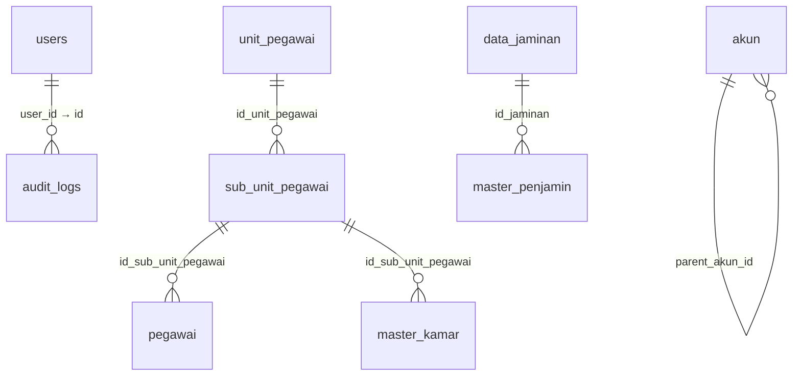

# SIMRSMB — API Documentation Backend

Base URL : `http://localhost:8000`
Versi : Master Data API (MySQL `simrsmb`)

## Autentikasi

Semua endpoint (`/api/*`) wajib menyertakan token Sanctum di header.

```
Authorization: Bearer <token>
```

- Tanpa token → `401 Unauthenticated`
- User berperan `user` (bukan `super`/`admin`) → `403 Forbidden` saat operasi tulis

---

## Skema Database & Relasi

### Relasi antar tabel (alur FK → PK)



### Daftar tabel

| Tabel | Kolom kunci |
|---|---|
| `users` | PK `id` |
| `audit_logs` | PK `id`, FK `user_id` → `users.id` |
| `unit_pegawai` | PK `id_unit_pegawai` |
| `sub_unit_pegawai` | PK `id_sub_unit_pegawai`, FK `id_unit_pegawai` → `unit_pegawai.id_unit_pegawai` |
| `pegawai` | PK `id_pegawai`, FK `id_sub_unit_pegawai` → `sub_unit_pegawai.id_sub_unit_pegawai` |
| `master_kamar` | PK `id`, FK `sub_unit_id` → `sub_unit_pegawai.id_sub_unit_pegawai` |
| `akun` | PK `id_akun`, FK `parent_akun_id` → `akun.id_akun` (self) |
| `data_jaminan` | PK `id_jaminan` |
| `master_penjamin` | PK `id`, FK `id_jaminan` → `data_jaminan.id_jaminan` |
| `master_tarif` | PK `id` |
| `master_icd_x` | PK `id` |
| `master_diagnosa_keperawatan` | PK `id` |

---

## Base URL Endpoints

Prefix : `/api/master-data`

| Resource | Path parameter | Keterangan |
|---|---|---|
| Unit Pegawai | `unit-pegawai` | unit kerja pegawai |
| Sub-unit Pegawai | `sub-unit-pegawai` | sub unit kerja pegawai |
| Kamar | `kamar` | master kamar rawat inap |
| Pegawai | `pegawai` | data pegawai |
| Akun | `akun` | chart of account (parent–child) |
| Tarif | `tarif` | master tarif layanan |
| ICD X | `icd-x` | kode ICD-10 |
| Diagnosa Keperawatan | `diagnosa-keperawatan` | master diagnosa keperawatan |
| Penjamin | `penjamin` | penjamin/BPJS |

---

## CRUD / Endpoint

Untuk tiap resource `{resource}` berlaku pola REST berikut:

| Method | URL | Hak akses | Status |
|---|---|---|---|
| `GET` | `/api/master-data/{resource}` | `super` / `admin` / `user` | 200 |
| `GET` | `/api/master-data/{resource}/{id}` | semua | 200 / 404 |
| `POST` | `/api/master-data/{resource}` | `super` / `admin` | 201 |
| `PUT` / `PATCH` | `/api/master-data/{resource}/{id}` | `super` / `admin` | 200 / 404 |
| `DELETE` | `/api/master-data/{resource}/{id}` | `super` / `admin` | 204 / 404 |

### Query parameter (khusus index)

```
?search=...     cari teks (nama/kode/deskripsi)
?per_page=25    jumlah per halaman (default 10)
?page=2         nomor halaman
?tipe_akun=Aset (khusus resource akun)
```

### Response index (pagination)

```json
{
  "data": [ ... ],
  "links": { "first": "...", "last": "...", "prev": null, "next": null },
  "meta": { "current_page": 1, "last_page": 1, "per_page": 10, "total": 42 }
}
```

Response `show`/`store`/`update` dibungkus dalam `{ "data": { ... } }`.

---

## Body Field tiap resource

### unit-pegawai

| Field | Tipe | Aturan |
|---|---|---|
| `nama_unit_pegawai` | string max 125 | required |
| `id_bidang_pegawai` | integer | nullable |

### sub-unit-pegawai

| Field | Tipe | Aturan |
|---|---|---|
| `id_unit_pegawai` | integer | required, `exists:unit_pegawai,id_unit_pegawai` |
| `nama_sub_unit_pegawai` | string max 125 | required |
| `point` | numeric ≥ 0 | required |

### kamar

| Field | Tipe | Aturan |
|---|---|---|
| `nama_kamar` | string max 255 | required |
| `kelas` | enum | `VIP, VIP B, I, II, III, ISOLASI, ICU` |
| `jumlah_tempat_tidur` | integer ≥ 1 | required |
| `sub_unit_id` | integer | required, `exists:sub_unit_pegawai,id_sub_unit_pegawai` |
| `keterangan` | text | nullable |

### pegawai (ringkas)

| Field | Tipe | Aturan |
|---|---|---|
| `nik_pegawai` | string max 125 | required, unique |
| `nama_pegawai` | string max 125 | required |
| `no_ktp_pegawai` | string max 125 | required, unique |
| `id_bidang_pegawai`, `id_unit_pegawai`, `id_status_kontrak_pegawai`, `id_profesi_pegawai` | integer | required |
| `id_sub_unit_pegawai` | integer | required, `exists:sub_unit_pegawai,id_sub_unit_pegawai` |
| `jenis_kelamin_pegawai` | enum | `L, P` |
| `pernikahan_pegawai` | string max 125 | required |
| `tempat_lahir_pegawai`, `tanggal_lahir_pegawai` | string / date | required |
| `alamat_pegawai`, `no_str_pegawai`, `no_estr_pegawai`, `no_sip_pegawai`, `tgl_sip_pegawai`, `tgl_berakhir_sip_pegawai` | — | nullable |
| `pegawai_keluar` | enum | `Aktif, Pensiun, Mutasi, Resign, Selesai Kontrak, Diberhentikan` |
| `id_level_kompetensi`, `id_ptkp`, `id_spesialis`, `is_ka_unit`, `is_kabid`, `is_direktur`, `is_kasi`, `non_point` | integer | nullable |

> Pada `PUT`, field unique (`nik_pegawai`, `no_ktp_pegawai`, `no_str_pegawai`, dsb.) otomatis mengecualikan record sendiri.

### akun

| Field | Tipe | Aturan |
|---|---|---|
| `kode_akun` | string max 100 | required |
| `nama_akun` | string max 255 | required |
| `tipe_akun` | enum | `Aset, Kewajiban, Modal, Pendapatan, Beban` |
| `nama_jenis_akun` | string max 100 | required |
| `nama_sub_akun` | string max 500 | required |
| `parent_akun_id` | integer | nullable, `exists:akun,id_akun` |
| `urut_akun`, `tipe_akun_id`, `level`, `arus_kas_id`, `kelompok_arus_kas_id`, `jaminan_id`, `layanan_id` | integer | nullable |
| `kategori_laba_rugi` | enum | `Operasional, Non Operasional` |

### tarif

| Field | Tipe | Aturan |
|---|---|---|
| `nama_tarif` | string max 255 | required |
| `nominal` | decimal ≥ 0 | required |
| `keterangan` | text | nullable |

### icd-x

| Field | Tipe | Aturan |
|---|---|---|
| `kode_icd` | string max 20 | required, unique |
| `deskripsi` | string max 255 | required |

### diagnosa-keperawatan

| Field | Tipe | Aturan |
|---|---|---|
| `kode_diagnosa` | string max 30 | required, unique |
| `deskripsi_diagnosa` | text | required |

### penjamin

| Field | Tipe | Aturan |
|---|---|---|
| `id_jaminan` | integer | required, `exists:data_jaminan,id_jaminan` |
| `nama_penjamin_sistem` | string max 255 | required |
| `kode_penjamin_bpjs` | string max 50 | nullable |
| `status_aktif` | enum `1/0` | required |

---

## Contoh Request/Response

### Login & token (tinker)

```bash
php artisan serve
php artisan tinker --execute '
$u = App\Models\User::firstOrCreate(
  ["email" => "admin@test.com"],
  ["name" => "Admin Test", "password" => "password", "role" => "admin"]
);
echo $u->createToken("api")->plainTextToken;'
```

### Get list tarif

```bash
curl -H "Authorization: Bearer $TOKEN" \
  http://localhost:8000/api/master-data/tarif
```

### Create akun

```bash
curl -X POST http://localhost:8000/api/master-data/akun \
  -H "Authorization: Bearer $TOKEN" \
  -H "Content-Type: application/json" \
  -d '{
    "kode_akun": "1010",
    "nama_akun": "Kas",
    "tipe_akun": "Aset",
    "nama_jenis_akun": "Aset Lancar",
    "nama_sub_akun": "Kas & Bank"
  }'
```

### Update & delete

```bash
curl -X PUT http://localhost:8000/api/master-data/tarif/1 \
  -H "Authorization: Bearer $TOKEN" -H "Content-Type: application/json" \
  -d '{"nama_tarif":"Konsultasi","nominal":150000}'

curl -X DELETE http://localhost:8000/api/master-data/kamar/3 \
  -H "Authorization: Bearer $TOKEN"
```

---

## Kode Status

| Kode | Arti |
|---|---|
| 200 | OK |
| 201 | Created |
| 204 | No Content (delete) |
| 401 | Unauthenticated (token invalid/absent) |
| 403 | Forbidden (role tidak diizinkan) |
| 404 | Not Found |
| 422 | Validation Error (`errors` object) |

---

## Daftar Endpoint Lengkap (45)

| Method | Endpoint |
|---|---|
| GET, POST, PUT, DELETE | `/api/master-data/unit-pegawai` (+`/{id}`) |
| GET, POST, PUT, DELETE | `/api/master-data/sub-unit-pegawai` (+`/{id}`) |
| GET, POST, PUT, DELETE | `/api/master-data/kamar` (+`/{id}`) |
| GET, POST, PUT, DELETE | `/api/master-data/pegawai` (+`/{id}`) |
| GET, POST, PUT, DELETE | `/api/master-data/akun` (+`/{id}`) |
| GET, POST, PUT, DELETE | `/api/master-data/tarif` (+`/{id}`) |
| GET, POST, PUT, DELETE | `/api/master-data/icd-x` (+`/{id}`) |
| GET, POST, PUT, DELETE | `/api/master-data/diagnosa-keperawatan` (+`/{id}`) |
| GET, POST, PUT, DELETE | `/api/master-data/penjamin` (+`/{id}`) |

---

## Halaman interaktif

Saat aplikasi berjalan (`php artisan serve`), buka `http://localhost:8000/` untuk melihat:
- Diagram ERD interaktif (pan/zoom/drag) dengan alur kabel tiap FK → PK
- Daftar relasi Foreign Key
- Seluruh link endpoint API (dapat diklik)